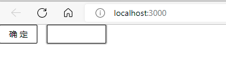
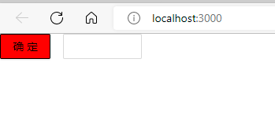

## 引入 antd 样式

#antd

这里说的方法都是基于 create-react-app 创建的项目, 其他项目根据打包方式不同会出现不同的引入方式。

第一种方式是在某个入口文件中引入 `antd/dist/antd.css`，入口文件可以是 js 或 css 文件。这个 `antd/dist/antd.css` 文件是 antd 通过编译 `less` 文件得到的输出文件，可以在项目或 html 文件中直接引入。里面包含了 antd 所有组件的样式。在 `antd/dist` 文件夹中还可以看到 `antd.compact.css`、`antd.dark.css`，分别对用了官方提供的紧凑主题、暗黑主题。引入 css 文件的好处是直接引入就能用，不像 scss 文件或 less 文件需要编译器转义一遍。缺点是会把所有组件样式都引入进来，且没法方便的定制修改全局样式。

第二种方式是引入 `antd/dist/antd.less`，入口文件可以是 js 或 less 文件。这种方式需要项目支持加载构建 less 文件。按照 antd 官方给的教程，需要用到 `@craco/craco`、`craco-less` 两个包来修改默认的打包配置。这种方式的好处是能方便的通过配置修改 less 的全局变量值，进而需改 antd 的全局样式。

## 修改 antd 的全局样式

如果想方便的全局替换所有组件的全局样式，必须采用第二种方式，通过覆盖 less 中的变量来实现。比如我们想定制 antd 的主题色为黑色，需要先引入 `antd.less`，然后在下方重写 `@primary-color` 变量。

```less
// App.less
@import '~antd/dist/antd.less';

@primary-color: black;
```


可以看到 `Button` 和 `Input` 的主题色已经被修改为黑色。antd 所有可修改的变量定义在文件 `components/style/themes/default.less` 中，每种组件用到什么变量都有注释。

还有一种覆盖变量的方法，是修改 less-loader 的配置。根据项目的打包方式不同，修改的配置文件也不一样。

## 覆盖 antd 的样式

虽然 antd 提供了这么多的变量供我们修改，但实际开发中依然会有覆盖不到的情况。比如 Button 组件的有个 ghost 类型，这种类型的样式就没有对应的可供覆盖的变量。这种情况下可以通过重新定义选择器的方式实现。比如我们将 ghost 按钮的背景色变为红色

```less
.ant-btn-background-ghost {
  background-color: red !important;
}
```



这种方式有个比较大的弊端是，需要大量运用 `!important` 改变规则的优先级，从而能正确覆盖 antd 默认的样式。当重新定义的选择器多了时，会很难维护。
