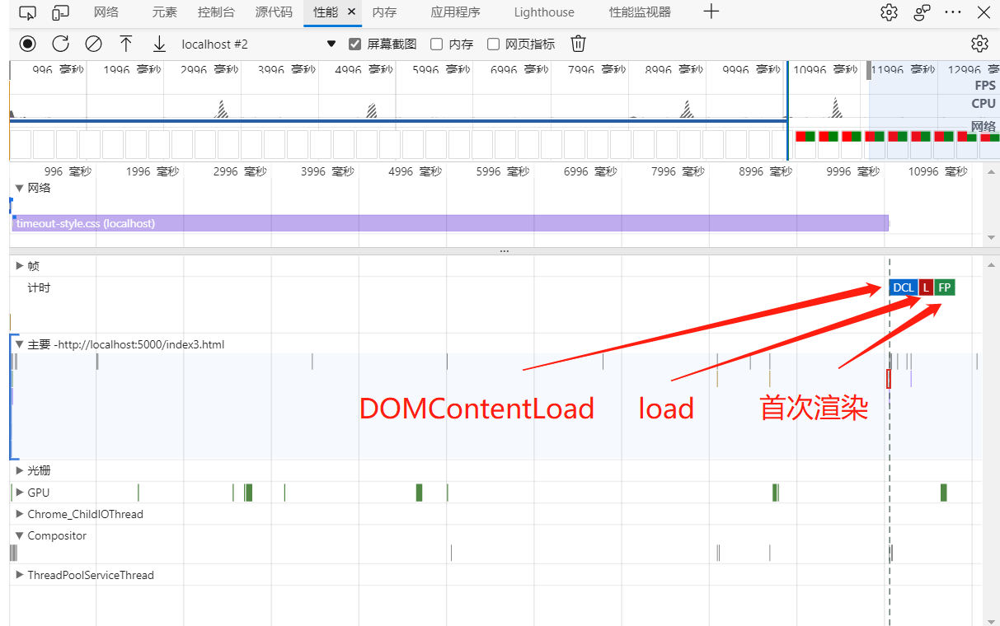

<!--
 * @Author: liubei
 * @Date: 2021-03-23 11:52:41
 * @LastEditTime: 2022-01-03 09:14:58
 * @Description: 
-->
# 使用开发者工具分析文档加载流程

最近在看《现代前端技术解析》这本书时，页面渲染类的优化方案中提到了 css 和 js 文件的引入优化。优化策略是有必要将 css 文件放到 head 中，将 js 文件放到 html 文件底部。这么做的原因是文件的加载和执行可能会阻塞 html DOM 的构建及页面渲染。看到这我就比较疑惑，为什么 css 和 js 还要区别对待？为了搞清楚这个问题，我使用了浏览器开发者工具中的性能面板做了些实践，尝试搞清楚 css 文件和 js 文件对页面加载的具体影响。下面先来看下这个开发者工具中性能面板的具体作用


可以看到，第一行是时间轴和FPS、CPU的性能指标。第二行是屏幕截图，可以用来观察页面的渲染情况。再往下是网络请求记录、主要任务、光栅、GPU等。我们分析页面加载流程时主要就是观察屏幕截图判断渲染情况、网络请求、主要任务。

在主要任务这一栏，会通过不同的色块区分不同的任务，蓝色部分是分析 html（解析 html 内容，构建 DOM 树），分析样式表（构建 CSSOM 树）。深棕色部分是计算脚本（编译、执行脚本）。深紫色部分是重新计算样式（将 CSSOM 和 DOM 组合，构建 Render 树），布局（对 Render 树布局，计算 DOM 元素的位置）。深绿色部分是画图（渲染 Render 树）和复合层（将 Render 树渲染的层发送到 GPU 进行复合操作，生成最终呈现的结果）


在主要任务这一栏还会将三个特殊事件节点标识出来，load事件触发时间、DOMContentLoaded事件触发时间、首次渲染时间

通过观察上边的三个事件节点，结合各任务的执行情况，我们可以看到 css 文件和 js 文件对页面加载的具体影响情况

# css 文件

前端性能优化策略说将所有 CSS 资源尽早指定在 HTML 文档 `<head>` 中，这样浏览器可以优先下载CSS并尽早完成页面渲染。那 css 文件真的会阻塞 DOM 树构建和页面渲染吗？浏览器是怎么优先下载 css 文件的呢？

```html
<!DOCTYPE html>
<html lang="en">

<head>
    <link rel="stylesheet" href="/timeout-style.css?timeout=0.01">
</head>
<body>
    <div style="width: 49%; height: 300px; background-color: red; float: left;"></div>
    <div style="width: 49%; height: 300px; background-color: green; float: right;"></div>
</body>
</html>
```


在性能面板上，我以 DOMContentLoaded 事件作为 DOM 树构建完成的标志，页面渲染可能是分区域、分步进行的，首次渲染表示用户能在屏幕上看到内容（如果渲染被阻塞，可能只看到部分内容）。在这个例子中可以看到，构建 DOM 树和下载 css 文件是并行的，先构建出 DOM 树，触发 DOMContentLoaded 事件，然后是 css 文件下载完成、构建 CSSOM，之后布局和绘制。所以 css 文件不会阻塞 DOM 树的构建，却会阻塞了页面的首次渲染。

CSS 的规范是相同的选择器，后定义的优先级较高，如果 CSSOM 的构建和页面渲染是并行的，就可能出现后创建的 CSSOM 因为优先级较高，频繁修改渲染结果的情况。只有构建完成的 CSSOM 才是最准确的，所以页面首次渲染需要在 CSSOM 构建完成之后进行。如果将 css 文件下载延迟10s，页面会不会一直不渲染呢？

```
<link rel="stylesheet" href="/timeout-style.css?timeout=10">
```


从图上看出，整个流程没有改变，还是 DOM 树先构建完成，触发 DOMContentLoaded 事件。等 css 文件下载完成后才进行首次渲染。由于 css 文件加载时间太长，导致页面一直卡在加载状态，没有内容

如果把 css 文件放到文档最后，会有什么结果呢？

```html
<!DOCTYPE html>
<html lang="en">

<head>
</head>
<body>
    <div style="width: 49%; height: 300px; background-color: red; float: left;"></div>
    <div style="width: 49%; height: 300px; background-color: green; float: right;"></div>
    <link rel="stylesheet" href="/timeout-style.css?timeout=10">
</body>
</html>
```


可以看到，浏览器会先进行首次渲染，等 css 文件下载完成后再触发 DOMContentLoaded 和 load 事件，然后重绘页面，说好的阻塞渲染呢！！！

当我出于好奇，将 css 文件放到 body 开始时，更诡异的一幕出现了，DOMContentLoaded、load 和首次渲染竟然都被延迟到 css 文件下载完成后。说好的不阻塞 DOM 树构建呢！！！

```html
<!DOCTYPE html>
<html lang="en">

<head>
</head>
<body>
    <link rel="stylesheet" href="/timeout-style.css?timeout=10">
    <div style="width: 49%; height: 300px; background-color: red; float: left;"></div>
    <div style="width: 49%; height: 300px; background-color: green; float: right;"></div>
</body>
</html>
```



到这里我已经有点凌乱了，css 文件的表现完全没有规律啊。当我再次好奇了下，把 css 文件放到 body 中间时，终于发现了规律

```html
<!DOCTYPE html>
<html lang="en">

<head>
</head>
<body>
    <div style="width: 49%; height: 300px; background-color: red; float: left;"></div>
    <link rel="stylesheet" href="/timeout-style.css?timeout=10">
    <div style="width: 49%; height: 300px; background-color: green; float: right;"></div>
</body>
</html>
```


css 文件会阻塞在其后出现的 DOM 元素，如果之前存在可渲染的 DOM 元素，就将首次渲染提前，先绘制出一部分内容到页面，这就解释了为什么放在 `<head>` 标签里和放在 body 最开始的 css 文件会阻塞首次渲染。放在 body 中间和最后时，首次渲染会提前到 css 文件加载之前。

## js 文件

对同步 js 文件的验证就简单很多，同步 js 一定会阻塞 DOM 树的构建，如果之前不存在 DOM 元素，会阻塞首次渲染，如果之前存在 DOM 元素，首次渲染会先渲染出之前的元素。


异步 js 分为 async 和 defer 两种，async 不会阻塞 DOM 树的构建，也不会阻塞首次渲染。


defer 不会阻塞 DOM 树的构建，也不会阻塞首次渲染，但会推迟 DOMContentLoaded 事件的执行。


# js 和 css 文件同时存在时

上边是页面上只有 css 文件或 js 文件的情况，当页面上同时存在 css 文件和 js 文件时，情况会更复杂一些，js 脚本可以操作 DOM 树和 CSSOM 树。当 js 文件在 css 文件之后时，这个 js 文件必须等待 css 文件下载解析完成 CSSOM，才能拿到正确的 CSSOM。也就是说 css 文件会阻塞 js 文件的解析和执行。而 js 文件又会阻塞 DOM 树的构建。这就间接导致 css 文件阻塞 DOM 树的构建。

```html
<!DOCTYPE html>
<html lang="en">
<head>
    <link rel="stylesheet" href="/timeout-style.css?timeout=2">
</head>

<body>
    <div style="width: 49%; height: 300px; background-color: red; float: left;"></div>
    <script src="/timeout-script.js?timeout=0.01"></script>
    <div style="width: 49%; height: 300px; background-color: green; float: right;"></div>
</body>
</html>
```

这个例子中，css 文件放在 head 中，会将首次渲染推迟到文件下载之后，css 本身不会阻塞 DOM 树的构建。由于 js 文件被 css 文件阻塞，所以 js 文件被推迟到 css 文件下载完成之后。DOM 树的构建又被 js 文件阻塞，所以导致 DOM 树的构建也被推迟。


# 总结

回到最初的优化策略，将 css 文件放到 head 中，将 js 文件放到 html 文件底部。书中给的理由是需要尽早开启 css 文件的下载，这样就能提前首次渲染的时间，用户早点看到内容。js 会阻塞其后的 DOM 元素的构建和渲染，所以放在页面的最后。从本次实践来看，js 放在最后确实可以优化页面的渲染速度，还可以通过设置异步 js 达到相同的优化效果。css 的这个优化策略是有问题的，head 中的 css 会阻塞页面首次渲染，而我们不能保证 css 的下载速度，整个页面的首次渲染变成了和网络稳定性和速度的强相关。我觉得最好的优化 css 文件的方式是，在不影响首次渲染样式的基础上实现 css 的异步加载。现在前端框架的优化方式也是类似的，尽量将首页的样式内联到 html 文件中，整个应用通过异步组件的方式将 css 文件做成异步加载。

本文还留了一个问题，浏览器是怎么优先下载 css 文件。在实践过程中发现，浏览器几乎会同时提前开始页面资源的下载，而不是等到解析到 link 和 script 标签。说明浏览器会优化资源的下载时机，这样的话，之前说的将 css 放到 head 中来尽早开启文件下载也就没那么必要了。