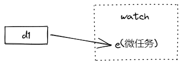

<!--
 * @Author: liubei
 * @Date: 2022-01-13 17:04:42
 * @LastEditTime: 2022-02-09 21:33:20
 * @Description: 
-->
# 响应式系统源码分析2

vue3 的 @vue/reactivity 包是框架响应系统的底层实现，其内部使用了观察者模式。我们知道观察者模式是用来定义一对多的依赖关系，一个对象状态发生变化时，所有依赖于它的对象都能得到通知。vue 框架实现的效果是，修改了响应式状态对象，所有依赖该状态对象的组件渲染函数重新执行并更新 DOM。下面我们从观察者模式角度来看一下 vue 是如何实现其响应系统的。

## Dep 和 ReactiveEffect

观察者模式主要的参与者有主题（Subject）和观察者（Observer），对应到 vue 系统中就是 Dep 和 ReactiveEffect。Dep 是一个 Set 类的别名。ReactiveEffect 类是观察者，其内部属性 deps 类型是 Dep 的数组，用来保存所有依赖。下图是 Dep 和 ReactiveEffect 的依赖关系图


ReactiveEffect 构造函数接受两个参数 fn 和 scheduler，fn 是实际执行的函数，其依赖都在 fn 函数内被收集。scheduler 是个调度函数，ReactiveEffect 被触发时，如果存在 scheduler 就执行 scheduler，否则执行 fn。核心代码如下

```js
export class ReactiveEffect<T = any> {
  deps: Dep[] = []
  constructor(
    public fn: () => T,
    public scheduler: EffectScheduler | null = null,
  ) {
  }

  run() {
    try {
        // activeEffect 是一个全局对象，fn 被执行时通过 activeEffect 能访问到当前 ReactiveEffect
        activeEffect = this
        return this.fn()
      } finally {
        activeEffect = undefined
      }
  }
}
```

### 依赖关系的构建

上图可以看到，和观察者模式的一对多关系不一样，Dep 和 ReactiveEffect 是多对多的关系。vue3 框架有多种方式创建两者的关联关系，比如 watchEffect、watch、computed 等。

watchEffect 函数定义如下，接受一个 effect 函数

```js
function watchEffect(
  effect: (onCleanup: OnCleanup) => void,
  options?: WatchEffectOptions
): StopHandle
```

watchEffect 内部会使用 effect 生成 ReactiveEffect 对象。当 effect 函数执行时，可以通过一个全局变量 activeEffect 访问到对应的 ReactiveEffect 对象，effect 函数执行完成后将 activeEffect 置空。

当 effect 函数内部使用了响应对象时，会触发 track 函数，用来让 activeEffect 追踪到这个响应式对象。这里需要提前说明一下，vue3 里的响应对象实现有 Ref、ShallowReactive、ComputedRefImpl 等。这些响应对象内部都会保存一个 Dep 对象，用来关联 ReactiveEffect。

```js
function track(target: object, type: TrackOpTypes, key: unknown) {
  // 先找到响应对象对应的 Dep
  let depsMap = targetMap.get(target)
  if (!depsMap) {
    targetMap.set(target, (depsMap = new Map()))
  }
  let dep = depsMap.get(key)
  if (!dep) {
    depsMap.set(key, (dep = createDep()))
  }

  // 追踪该 Dep
  trackEffects(dep)
}

function trackEffects(
  dep: Dep,
  debuggerEventExtraInfo?: DebuggerEventExtraInfo
) {
  ...
  // 创建 ReactiveEffect 和 Dep 的关联关系
  dep.add(activeEffect!)
  activeEffect!.deps.push(dep)
  ...
}
```

有了这个关联关系，当响应对象状态发生变化时，框架会执行 trigger 函数触发所有依赖响应对象的 effect 重新执行。可以看下 trigger 代码

```js
export function trigger(
  target: object,
  type: TriggerOpTypes,
  key?: unknown,
  newValue?: unknown,
  oldValue?: unknown,
  oldTarget?: Map<unknown, unknown> | Set<unknown>
) {
  // 这里通过 target type key 三个参数找到所有需要重新执行的 effect
  ...
  triggerEffects(createDep(effects))
}

function triggerEffects(
  dep: Dep | ReactiveEffect[],
  debuggerEventExtraInfo?: DebuggerEventExtraInfo
) {
  for (const effect of isArray(dep) ? dep : [...dep]) {
    if (effect.scheduler) {
      // 执行 effect 的调度器，一般用来推迟 effect 的执行
      effect.scheduler()
    } else {
      // 立即重新执行 effect
      effect.run()
    }
  }
}

```

框架使用 track 和 trigger 这俩函数追踪依赖和触发执行。这俩函数的执行机制是通过 Proxy 代理的方式实现，具体实现逻辑这里不做说明。

这里特别说一下 ReactiveEffect 的 scheduler 方法的作用， trigger 函数执行时，会判断 effect.scheduler 存在就执行，用来执行 effect 的调度器。这个调度器可以实现推迟执行 effect 的作用，比如将 effect 作为微任务执行


## ref 和 RefImpl

之前说了响应对象的实现方式有多种，Ref 就是其中一种。响应对象内部保存了 Dep 对象，用来实现观察者模式的主题（Subject）功能。vue3 导出的 ref 是一个函数，用来生成一个 Ref 对象。RefImpl 是 Ref 的实现类。


具体代码实现如下

```js
class RefImpl<T> {
  private _value: T
  public dep?: Dep = undefined

  constructor(value: T) {
    this._value = value
  }

  get value() {
    trackRefValue(this)
    return this._value
  }

  set value(newVal) {
    this._value = newVal
    triggerRefValue(this, newVal)
  }
}

export function trackRefValue(ref: RefBase<any>) {
  if (!ref.dep) {
    // 这里生成 Ref 对应的 Dep 对象
    ref.dep = createDep()
  }
  // 追踪该 dep 对象
  trackEffects(ref.dep)
}
```

## computed 和 ComputedRefImpl

computed 函数使用其他响应对象来派生出一个新的响应对象，该响应对象会随着其依赖的响应对象改变而改变。从观察者模式可以看到，ComputedRefImpl 同时表现出了主题（Subject）和观察者（Observer）两种特性。函数定义如下，可以看到返回的是一个 Ref 对象。ComputedRefImpl 类就是这个返回 Ref 的实现类。

```js
function computed<T>(
  getter: () => T,
): Readonly<Ref<Readonly<T>>> {
  const cRef = new ComputedRefImpl(getter, setter, onlyGetter || !setter)

  return cRef as any
}


class ComputedRefImpl<T> {
  public dep?: Dep = undefined
  private _value!: T
  private _dirty = true
  public readonly effect: ReactiveEffect<T>

  constructor(
    getter: ComputedGetter<T>,
    private readonly _setter: ComputedSetter<T>,
    isReadonly: boolean
  ) {
    this.effect = new ReactiveEffect(getter, () => {
      // 该函数是个调度器，当 effect 重新执行时，会执行该调度器将 _dirty 置为 true，且触发
      if (!this._dirty) {
        this._dirty = true
        triggerRefValue(this)
      }
    })
  }

  get value() {
    const self = toRaw(this)
    trackRefValue(self)
    if (self._dirty) {
      self._dirty = false
      self._value = self.effect.run()!
    }
    return self._value
  }
}
```

在代码中，ComputedRefImpl 拥有 dep 和 effect 这两个属性，这也是其能同时表现出主题（Subject）和观察者（Observer）两种特性的原因


ComputedRefImpl 使用 _dirty 属性来标识当前是否是脏值，在依赖发生变化时，触发其 effect 执行，将 _dirty 标记为 true。当 ComputedRefImpl 作为依赖被使用时，根据 _dirty 是否为脏值决定是否重新计算

## watch

watch 函数经常被拿来和 computed 比较，在源码中可以看到 watch 属于 @vue/runtime-core 包，computed 属于 @vue/reactivity 包。把 watch 独立出来的原因是，watch 依赖框架的 Scheduler 系统。

官方文档介绍的和 watch 相关的函数有4个，watch、watchSyncEffect、watchPostEffect、watchEffect。这里重点看下 watchEffect 的第二个参数 WatchEffectOptions 的定义

```js
// flush 参数定义了 effect 执行的时机
interface WatchEffectOptions {
  flush?: 'pre' | 'post' | 'sync' // default: 'pre'
}
```

可以看到，watchEffect 函数的第二个参数可以传递 flush 参数，用来指定 effect 函数的执行时机。这个时机是在组件更新之前还是之后，或者是 sync 执行。

框架的 Scheduler 系统存储着异步执行的任务队列，当向队列中放入任务时，就会启动一个微任务，用来在该微任务中清空任务队列。这样看 Scheduler 其实是比微任务粒度更小的异步任务队列。系统内存在3个 SchedulerJob 类型的数组，定义如下

```js
const queue: SchedulerJob[] = []
const pendingPreFlushCbs: SchedulerJob[] = []
const pendingPostFlushCbs: SchedulerJob[] = []
```

不同的队列保存的任务不同，我们常见的组件更新任务就放在 queue 队列中。当清空任务执行时会按顺序依次执行并清空 pendingPreFlushCbs、queue 和 pendingPostFlushCbs。这样我们就知道 flush 的实现原理，当 flush 为 pre 时，effect 被放到 pendingPreFlushCbs 队列，为 post 时放到 pendingPostFlushCbs 队列，为 sync 时不放到异步队列，直接执行。

回到观察者模式角度，watch 类的几个函数内部都创建了 ReactiveEffect，是一个观察者的角色。比较特殊的是，他们可以把响应放到异步队列延迟执行。

