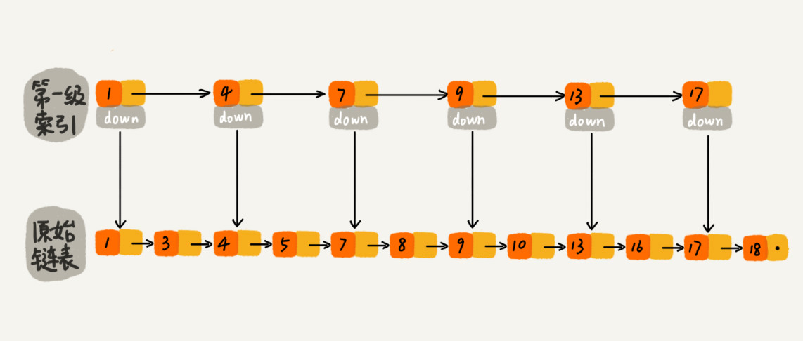
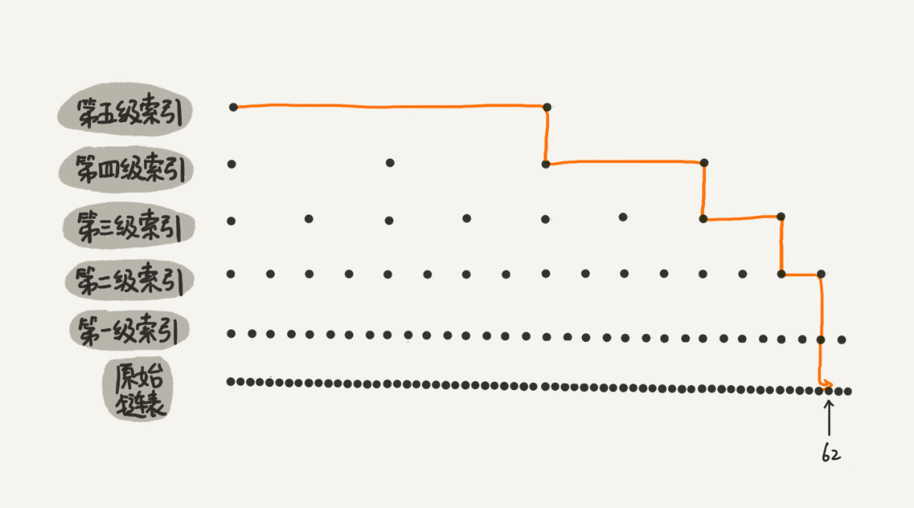

# 跳表
二分法可以实现时间复杂度为O(logn)的查找，但是底层数据结构是数组，借助数组随机访问特性实现。

链表查找操作的时间复杂度为O(n)，如果是有序链表，可以通过跳表的方式，将查找、插入、删除操作的时间复杂度都减小到O(logn)

## 实现思想
二分法可以有效减小要遍历的元素数量，链表只能从表头向后遍历，可以通过创建索引的方法，实现类似二分法。

原始链表如下

每个一个点提取一个元素到上一级索引，构建索引后如下

查找操作时，先在索引层查找到元素所在的范围，然后下沉到原始链表，继续向后查找

在一个具有5级索引的跳表中执行查找步骤如下

跳表的索引是每隔一个元素提取一个，原始链表元素个数是n, 第一级索引元素个数是n/2, 第二层是n/4, 第k级索引元素的个数是k-1级索引的1/2, 最后一级索引个数是2。这样第k层索引的元素个数是n/(2**k)

假如有h层索引，则 n/(2**h)=2。 可以得到 h=logn-1。 算上原始链表，h=logn。

由于每层查找的元素个数最大是3个，所有最大查找次数就是3*h=3*logn, 时间复杂度是O(logn)

跳表通过空间换时间的方法提高了查询效率，空间复杂度是O(n)。
